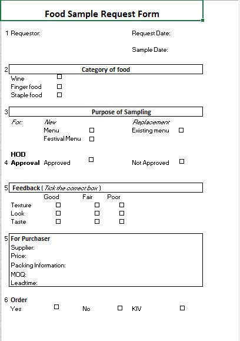

# Food-Sample-Request-Form
**Description**

Restaurant Fillable Form
--------
## Documentation
**Overview**
This form is required because some staff asked supplier for sample (it can be a bottle of wine or finger food} and we want to exercise control). Head of Dpartment must know and approve.
Staff must indicate if this item is for
(1) new restaurant menu
(2) Festival menu
OR
(3) Replacement of exising menu

They must give their feedback after tasting the sample product to close the loop, example: Texture, Look, Taste.
Lastly indicate if they want to proceed to order: Yes No KIV
## Problem Statement
The restaurant staff requested samples from suppliers without informing the Head of Department, likely for personal use rather than for the benefit of the restaurant. Once the HOD became aware of this, they sought to regulate the process of requesting samples from suppliers.
## Problem Solution and Tool used
MS Excel was used to create a fillable form: [**Excel**](https://www.microsoft.com/en-us/microsoft-365/excel) that include: 
- Requestor name
- Sample requested
- Date
- Purpose of request
- HOD approval section (to either approve the sample collection or not)
- Feedback from the Requestor
  This approach help the restaurant to regulate sample collection and improve their relationship with suppliers.
  ## Form created
  
  
  
